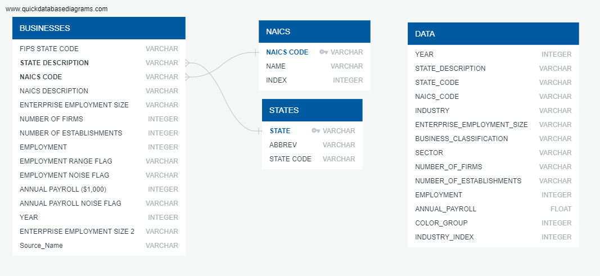

# Project 2 Group 10

## Dashboard Overview

Our project utilizes data that breaks down employment by industry, business size, and revenue. It consists of the following visualizations:

1. **Stacked Bar Chart**- Uses the Flask routing @/linechart

2. **Scatterplot**- Uses the Flask routing @/scatterplot

This page shows the data imported from the Database **Data** and returned in a jsonified output for your viewing pleasure.

3. **BubbleChart**- Uses the Flask routing @/bubble

This page shows the data imported from the Database Data and returned in a jsonified output for your viewing pleasure.

4. **/api/data**- Shows the imported and jsonified Database Table_df

This page uses Pandas to convert the data to a color map. This map shows a breakdown of Small Business Data showing state by state comparisons with color intensity as the relative strength of each industry. Using D3 and Bootstrap, you have interactivity and automated image printing. Run in LocalHost:8000

This page uses Pandas to convert the data to a color map. This map shows a breakdown of Big Business Data showing state by state comparisons with color intensity as the relative strength of each industry. Using D3 and Bootstrap, you have interactivity and automated image printing. Run in LocalHost:8000

## SQL DataBase

We utilize a Flask Server which connects locally to this DataBase. The raw data is imported from **.csv** files and joined into the table **Data** to be transformed into the Visualizations you viewed above.

## Presentation

It tells the story.

- - -

### Instructions

To begin:

1. **PGAdmin4**- Open the Browser of your choice and begin running this program, you must keep it open throughout the operation of the Dashboard. Create a Database within your postgresql server named **Enterprises**, and open the query tool within this Database. Paste the code from the file **static\data\US_Enterprises-CreateTable.sql**, and follow the instructions outlined within, you will need to import the following 4 files after creating their tables.

    a. **static\data\2017_NAICS_Structure_Summary.csv**

    b. **static\data\Consolidated State_NAISC Sector 2008-2017. csv**

    c. **static\data\state_codes.csv**

    d. **static\data\data.csv**

2. **app.py**- Within the main directory of **Group10_PROJECT2** you will find this file, {dbuser} & {dbpassword} will need to match your postgresql server user credentials (save the changes).

3. **Group10_PROJECT2**- Navigate to this top level directory within your bash terminal.

4. **python app.py**- Input this in the command line to begin operating the Flask Server.

5. **LocalHost:5000**- Type this into a new tab of the browser you opened previously to begin viewing the Dashboard.

6. **/api/data**- If you wish to view the data in JSON format append this code to the preceding browser url.

7. **Navigation**- Simply use the Navbar at the top of the landing page to view the linked html pages, and the interactive sliders and filters to for the Data Visualizations.

8. **LocalHost:8000**- Run this server from VSCode terminal in **GROUP10_Project2** with the command line **python -m http.server**, click on the files /Small Business Map.html /Big Business Map.html to see the data analysis by State.

### Copyright

Credit
Team 10, Google, and many other things.
